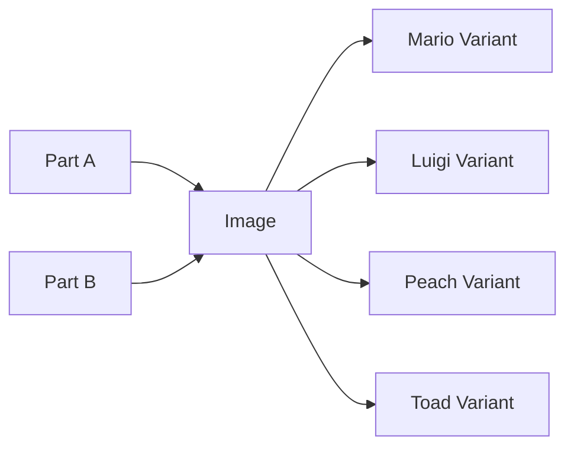
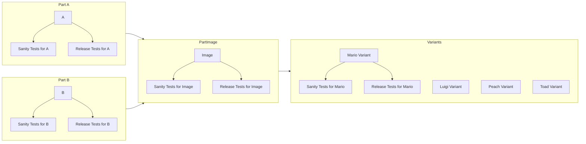

# big-complicated-pipeline
A test project to see what a complicated pipeline could look like

This project does not do anthing useful - it contains some scripts to run that will fake a complicated pipeline of builds and tests that mimicks a large embedded software product to be built, tested and released.

## Overall

The embedded software image "Image" is built from two parts: "Part A" and "Part B" - these two parts have to be built first - and then combined into the final "Image".

The "Image" will then be configured into multiple variants for the final releaseable products.

For each of these levels (Part A, Part B, Image, Variants) - a suite of tests are available - "sanity" tests - that are supposed to run through-out the day to validate commits to that part of the repo - and "release" tests - that are supposed to run nightly for all parts - for the same git sha to get an overview of what a release done at that particular git sha would look like.

Or put in a list:
* Part A
  * Sanity tests for Part A
  * Release tests for Part A
* Part B
  * Sanity tests for Part B
  * Release tests for Part B
* Image
  * Sanity tests for Image
  * Release tests for Image
* Mario Variant
  * Sanity tests for Mario Variant
  * Release tests for Mario Variant
* Luigi Variant
  * Sanity tests for Luigi Variant
  * Release tests for Luigi Variant
* Peach Variant
  * Sanity tests for Peach Variant
  * Release tests for Peach Variant
* Toad Variant
  * Sanity tests for Toad Variant
  * Release tests for Toad Variant
  
For newer releases (other branches) of these product, the number of and names of variants might change.

It is also important to say that for some of the variants, re-using one or more tests is obviously possible - but that will be handled by the test framework that these various variants.

## Repo structure

The repo is branched at the top, for the four main parts:
* [part_a](part_a)
* [part_b](part_b)
* [image](image)
* [variants](variants)

For each of these main parts, there is a way to build the part - and test them.

For instance, to build part_a, run "build.sh" and to test it run "tests/run.sh" with the relevant parameters.

Since this is an embedded product - testing it requires writing the part to an electronic device and then talk to that device to test it.

If you have never tested embedded software before, the key take-away is that it is very hard to run faster than "real-time" - simply because you need to allow the product to take in the input as it normally wood and then allow the normal "real-time/clock-time/wall-time" to pass before being able to read the outputs - that and because embedded hardware is usually slower than the PC driving the test - these tests take a long time to run.

As a consequence of the long tests - they have been split up into groups, each of the parts can have various groups - this can also change depending on the branch.

